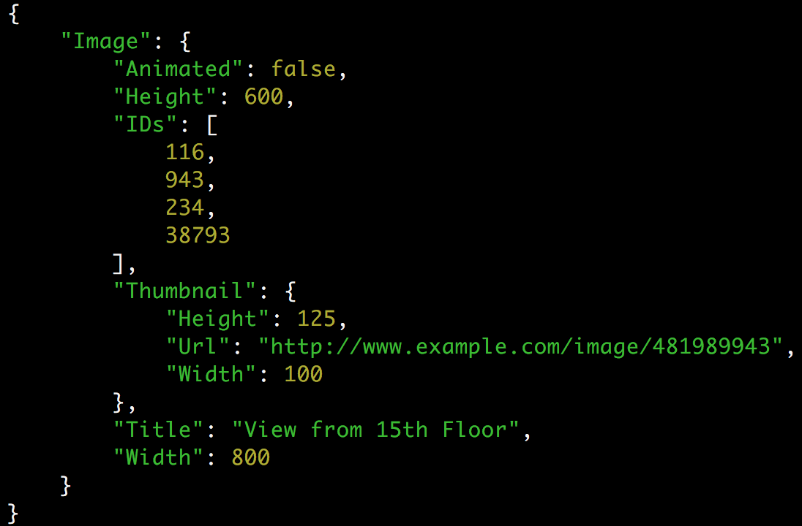

# json_ppc

A command line tool to display JSON files with colored values.
Objects properties are displayed sorted according to Unicode code points order.
The colors of the values are inspired from the `util.inspect` method.

## How to use

```bash
$ npm install -g json_ppc
$ json_ppc /path/to/my.json
```

Sample output:



## References

- [RFC 8259 - The JavaScript Object Notation (JSON) Data Interchange Format](https://tools.ietf.org/html/rfc8259)
- [ANSI escape code](https://en.wikipedia.org/wiki/ANSI_escape_code)

## License

```
A command line tool to display JSON files with colored values.
Copyright (C) 2018 Thomas Kerbrat

This program is free software: you can redistribute it and/or modify
it under the terms of the GNU General Public License as published by
the Free Software Foundation, either version 3 of the License, or
(at your option) any later version.

This program is distributed in the hope that it will be useful,
but WITHOUT ANY WARRANTY; without even the implied warranty of
MERCHANTABILITY or FITNESS FOR A PARTICULAR PURPOSE.  See the
GNU General Public License for more details.

You should have received a copy of the GNU General Public License
along with this program. If not, see <https://www.gnu.org/licenses/>.
```
